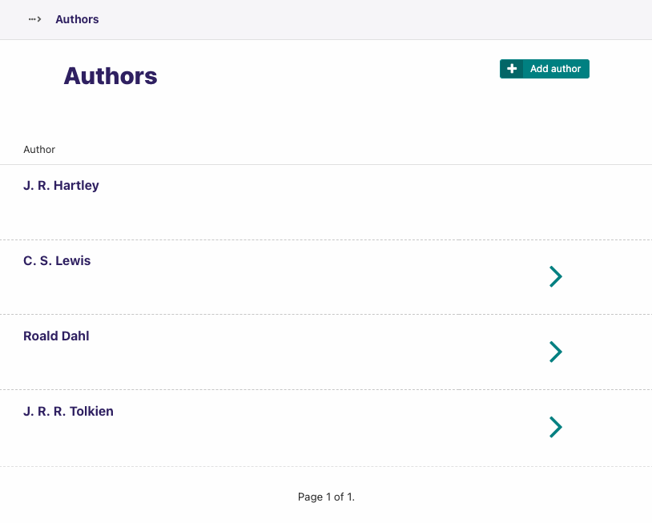

# Wagtail-TreeModelAdmin


[](https://coveralls.io/github/cfpb/wagtail-treemodeladmin?branch=main)



Wagtail-TreeModelAdmin is an extension for Wagtail's [wagtail-modeladmin](https://github.com/wagtail-nest/wagtail-modeladmin) that allows for a page explorer-like navigation of Django model relationships within the Wagtail admin.

- [Dependencies](#dependencies)
- [Installation](#installation)
- [Concepts](#concepts)
- [Usage](#usage)
    - [Quickstart](#quickstart)
- [API](#api)
- [Getting help](#getting-help)
- [Getting involved](#getting-involved)
- [Licensing](#licensing)
- [Credits and references](#credits-and-references)

## Dependencies

- Python 3.8+
- Django 3.2 (LTS), 4.1 (current)
- Wagtail 5.1+
- [wagtail-modeladmin](https://github.com/wagtail-nest/wagtail-modeladmin)

It should be compatible with all intermediate versions, as well.
If you find that it is not, please [file an issue](https://github.com/cfpb/wagtail-treemodeladmin/issues/new).

## Installation

1. Install wagtail-treemodeladmin:

```shell
pip install wagtail-treemodeladmin
```

2. Add `treemodeladmin` (and `wagtail_modeladmin` if it's not already) as an installed app in your Django `settings.py`:

 ```python
 INSTALLED_APPS = (
     ...
     'wagtail_modeladmin',
     'treemodeladmin',
     ...
 )
```

## Concepts

Wagtail-TreeModelAdmin allows for a Wagtail page explorer-like navigation of Django one-to-many relationships within the Wagtail admin. In doing this, it conceptualizes the Django [`ForeignKey`](https://docs.djangoproject.com/en/2.0/ref/models/fields/#django.db.models.ForeignKey) relationship as one of parents-to-children. The parent is the destination `to` of the `ForeignKey` relationship, the child is the source of the relationship.

Wagtail-TreeModelAdmin is an extension of [wagtail-modeladmin](https://github.com/wagtail-nest/wagtail-modeladmin). It is intended to be used exactly like `ModelAdmin`.

## Usage

### Quickstart

To use Wagtail-TreeModelAdmin you first need to define some models that will be exposed in the Wagtail Admin.

```python
# libraryapp/models.py

from django.db import models


class Author(models.Model):
    name = models.CharField(max_length=255)

class Book(models.Model):
    author = models.ForeignKey(Author, on_delete=models.PROTECT)
    title = models.CharField(max_length=255)
```

Then create the `TreeModelAdmin` subclasses and register the root the tree using `modeladmin_register`:

```python
# libraryapp/wagtail_hooks.py
from wagtail_modeladmin.options import modeladmin_register

from treemodeladmin.options import TreeModelAdmin

from libraryapp.models import Author, Book


class BookModelAdmin(TreeModelAdmin):
    model = Book
    parent_field = 'author'


@modeladmin_register
class AuthorModelAdmin(TreeModelAdmin):
    menu_label = 'Library'
    menu_icon = 'list-ul'
    model = Author
    child_field = 'book_set'
    child_model_admin = BookModelAdmin
```

Then visit the Wagtail admin. `Library` will be in the menu, and will give you a list of authors, and each author will have a link that will take you to their books.

## API

Wagtail-TreeModelAdmin uses three new attributes on ModelAdmin subclasses to express parent/child relationships:

- `parent_field`: The name of the Django [`ForeignKey`](https://docs.djangoproject.com/en/2.0/ref/models/fields/#django.db.models.ForeignKey) on a child model.
- `child_field`: The [`related_name`](https://docs.djangoproject.com/en/3.2/ref/models/fields/#django.db.models.ForeignKey.related_name) on a Django `ForeignKey`.
- `child_model_admin`

Any `TreeModelAdmin` subclass can specify both parent and child relationships. The root of the tree (either the `TreeModelAdmin` included in a `ModelAdminGroup` or the `@modeladmin_register`ed `TreeModelAdmin` subclass) should only include `child_*` fields.

## Getting help

Please add issues to the [issue tracker](https://github.com/cfpb/wagtail-treemodeladmin/issues).

## Getting involved

General instructions on _how_ to contribute can be found in [CONTRIBUTING](CONTRIBUTING.md).

## Licensing

1. [TERMS](TERMS.md)
2. [LICENSE](LICENSE)
3. [CFPB Source Code Policy](https://github.com/cfpb/source-code-policy/)

## Credits and references

1. Forked from [cfgov-refresh](https://github.com/cfpb/cfgov-refresh)
